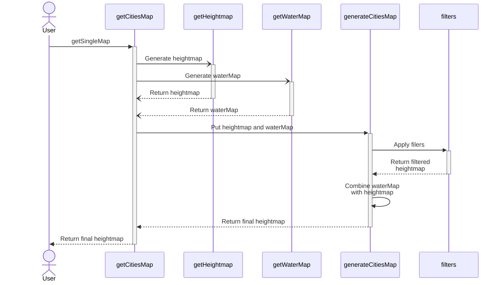
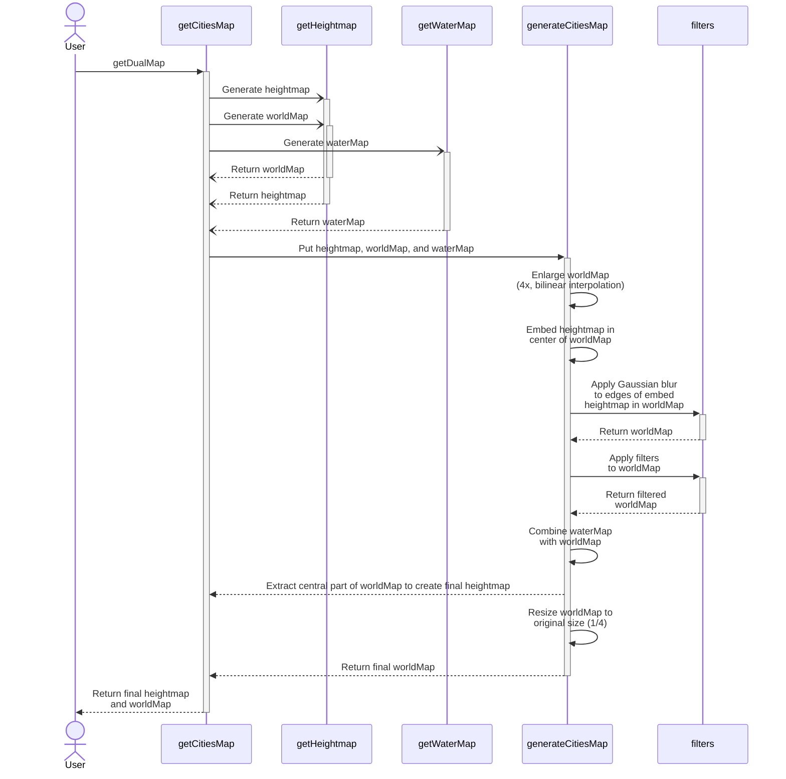

```mermaid
sequenceDiagram
  actor User
  participant A as getCitiesMap
  participant B as getHeightmap
  participant C as getWaterMap
  participant D as generateCitiesMap
  participant E as filters

  User ->> +A: getSingleMap
  A -) +B: Generate heightmap
  A -) +C: Generate waterMap
  B --) -A: Return heightmap
  C --) -A: Return waterMap
  A ->> +D: Put heightmap and waterMap
  D ->> +E: Apply filers
  E -->> -D: Return filtered<br>heightmap
  D ->> D: Combine waterMap<br>with heightmap
  D -->> -A: Return final heightmap
  A -->> -User: Return final heightmap
``` 

```mermaid
sequenceDiagram
  actor User
  participant A as getCitiesMap
  participant B as getHeightmap
  participant C as getWaterMap
  participant D as generateCitiesMap
  participant E as filters

  User ->> +A: getDualMap
  A -) +B: Generate heightmap
  A -) +B: Generate worldMap
  A -) +C: Generate waterMap
  B --) -A: Return worldMap
  B --) -A: Return heightmap
  C --) -A: Return waterMap
  A ->> +D: Put heightmap, worldMap, and waterMap
  D ->> D: Enlarge worldMap<br>(4x, bilinear interpolation)
  D ->> D: Embed heightmap in<br>center of worldMap
  D ->> +E: Apply Gaussian blur<br>to edges of embed<br>heightmap in worldMap
  E -->> -D: Return worldMap
  D ->> +E: Apply filters<br>to worldMap
  E -->> -D: Return filtered<br>worldMap
  D ->> D: Combine waterMap<br>with worldMap
  D -->> A: Extract central part of worldMap to create final heightmap
  D ->> D: Resize worldMap to<br>original size (1/4)
  D -->> -A: Return final worldMap
  A -->> -User: Return final heightmap<br>and worldMap
```
